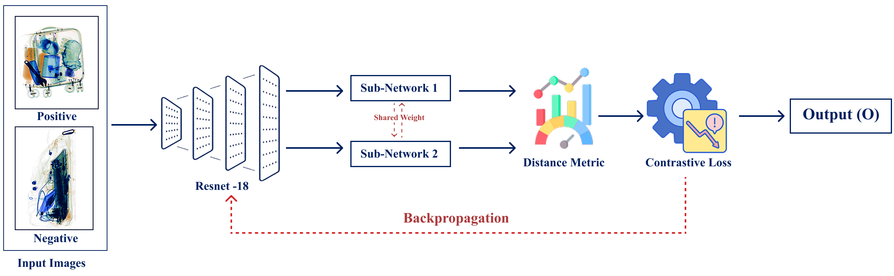

# X-Ray Anomaly Detection Using Siamese Network

## Overview
This project implements an anomaly detection system for X-ray images using a Siamese Neural Network. The goal is to identify anomalies in cargo X-ray images by comparing pairs of images (positive and negative samples) to determine if they belong to the same class (similar or dissimilar). The model leverages a ResNet-18 backbone, shared weights between two sub-networks, and Contrastive Loss to learn meaningful embeddings for image comparison.

The project is implemented in Python using PyTorch, and it runs on Google Colab with GPU acceleration for efficient training.

## Architecture
The model architecture is based on a Siamese Network, as illustrated in the flow diagram below:



### Flow Diagram Explanation
- **Input Images**: The network takes pairs of X-ray images (positive and negative samples).
- **ResNet-18 Backbone**: Each image is passed through a ResNet-18 model (pre-trained on ImageNet) to extract features. The fully connected layer of ResNet-18 is replaced with a custom linear layer to output a 512-dimensional embedding.
- **Sub-Networks with Shared Weights**: Two sub-networks (Sub-Network 1 and Sub-Network 2) share the same ResNet-18 weights to ensure consistent feature extraction.
- **Distance Metric**: The embeddings from the two sub-networks are compared using Euclidean distance.
- **Contrastive Loss**: The model is trained using Contrastive Loss to minimize the distance between similar pairs (same class) and maximize the distance between dissimilar pairs (different classes).
- **Backpropagation**: The loss is backpropagated to update the shared weights of the network.
- **Output**: The model outputs a similarity score, which is thresholded to classify pairs as similar (1) or dissimilar (0).

## Features
- **Anomaly Detection**: Detects anomalies in X-ray images by comparing image pairs.
- **Siamese Network**: Uses a Siamese architecture with shared weights for efficient comparison.
- **Contrastive Loss**: Optimizes embeddings to distinguish between similar and dissimilar pairs.
- **Pre-trained ResNet-18**: Leverages transfer learning for better feature extraction.
- **GPU Support**: Optimized for training on Google Colab with GPU acceleration.

## Technologies Used
- **Python**: 3.x
- **PyTorch**: For building and training the Siamese Network.
- **Torchvision**: For pre-trained ResNet-18 and data transformations.
- **Google Colab**: For running the notebook with GPU support.
- **Libraries**: NumPy, OpenCV, Matplotlib, Scikit-learn, PIL, TQDM.

## Dataset
The dataset consists of X-ray images divided into two categories:
- **Positive Samples**: X-ray images containing anomalies.
- **Negative Samples**: X-ray images without anomalies.

The images are stored in the following directories on Google Drive:
- Positive samples: `/content/drive/MyDrive/Minor Project/DvXray_Positive_Samples`
- Negative samples: `/content/drive/MyDrive/Minor Project/DvXray_Negative_Samples`

Images are preprocessed by resizing to 224x224 pixels, converting to RGB, and normalizing using ImageNet statistics.

## Installation
1. **Clone the Repository**:
   ```bash
   git clone https://github.com/your-username/xray-anomaly-detection.git
   cd xray-anomaly-detection
